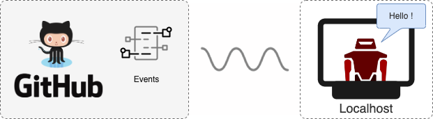

<image align="left" src="docs/images/robot.png" height="200">

### This is Max, a speech bot!

Max is a GitHub App that listens to events and notifies the User verbally. Hopefully making it more fun to keep up with GitHub activities.

    

## Quickstart

`Max` needs to run on your local system in order to "speak" to you. Since `Max` is based on Probot, we recommend that you run it locally in **Dev mode** (`npm run dev`).

## What does it look like?!

